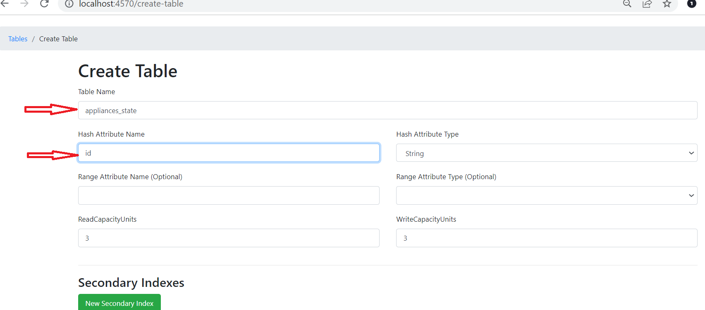

# applicance-control-service Project

**applicance-control-service** project provides the REST API to maintain the state of the appliances. It uses dynamoDb as database and 
saves the appliance state as Json. REST API accepts Json representation of an appliance without any limitation on schema.

* API specification can be found at http://localhost:8080/swagger.
* ```./buildDocker.sh``` script can be used to build the application docker Image.


## To Run the application
Project can be up and functional with below 3 steps:

1) From the root of the application, execute to build the application docker image:
```shell script
> ./buildDocker.sh
```
2) From the root of the application, execute to build the start the application:
```
> docker-compose up
```
3) Create a table to save the appliance state

   1) Access Local DynamoDb UI at: http://localhost:4570
   2) click on ``Create Table`` button
   3) Enter table name as ``appliances_state`` 
   4) Enter ``Hash Attribute Name`` as ``id``
   


That's it. 


###Below are some useful url's to interact with the api:
Execute from command line and root of the project.  
````aidl
curl -X POST -H "Content-Type: application/json" -H "x-api-key: 853d6a6d-ac97-44ac-aa2e-c0c83c9e1c4d" --data @body.json http://localhost:8080/appliance/123
curl -X PUT -H "Content-Type: application/json" -H "x-api-key: 853d6a6d-ac97-44ac-aa2e-c0c83c9e1c4d" --data @body.json http://localhost:8080/appliance/123
curl -X GET -H "x-api-key: 853d6a6d-ac97-44ac-aa2e-c0c83c9e1c4d" http://localhost:8080/appliance/123
curl -X GET -H "x-api-key: 853d6a6d-ac97-44ac-aa2e-c0c83c9e1c4d" http://localhost:8080/appliance/123/power
curl -X GET -H "x-api-key: 853d6a6d-ac97-44ac-aa2e-c0c83c9e1c4d" http://localhost:8080/appliance/123/power/maxRangeValue
curl -X PATCH -H "Content-Type: application/json" -H "x-api-key: 853d6a6d-ac97-44ac-aa2e-c0c83c9e1c4d" --data @patchAttributeBody.json http://localhost:8080/appliance/123/location
curl -X PATCH -H "Content-Type: application/json" -H "x-api-key: 853d6a6d-ac97-44ac-aa2e-c0c83c9e1c4d" --data @patchAttributeResourceBody.json http://localhost:8080/appliance/123/location/uncertainty
curl -X DELETE -H "x-api-key: 853d6a6d-ac97-44ac-aa2e-c0c83c9e1c4d" http://localhost:8080/appliance/123
````
***Note***: First request after the api is started might take a few sec to process but further requests should be faster.
These url's are tested in ``windows`` and ``cmder``.


###Key Urls's:

* Api: http://localhost:8080

* Api specification:http://localhost:8080/swagger

* DynamoDb GUI: http://localhost:4570

## Running the application in dev mode (for developers)

You can run your application in dev mode that enables live coding using:
```shell script
./gradlew quarkusDev
```

> **_NOTE:_**  Quarkus ships with a Dev UI, which is available in dev mode only at http://localhost:8080/q/dev/.

###Authentication:
ApiKey is passed to the environment variable ``API_KEY`` with a value which will be used to validate the api requests.
To access the API valid api key need to be passed in the header ``x-api-key``.

##Design specifications:
* Quarkus, the Supersonic Subatomic Java Framework has been chosen to build this REST API mainly because of its asynchronous reactive programming features.
* NoSql DynamoDb has been chosen to save the appliance state as Json and for its simplicity.
* To save wide varieties of the appliances, Api is built based on Json, so it accepts any json representation of an appliance. 
* Full appliance state or specific attribute or a specific resource of an attribute can be retrieved/updated using GET or PATCH endpoints.
* As log as the path parameters match the saved json key's, any attribute/resource of an attribute of any appliance can be retrieved/updated.

####May be Improvements:
* If the appliances are accessed using other than ``id`` from dynamoDb, secondary indexes can be configured for faster access.
* Dynamodb has item size of 400kb. If higher size, robust queries and aggregations are needed mangoDb would be one of the choice.
* DynamoDb provides single digit milli-second latency but a cache can be implemented for faster access.
* For centralized cache(if deployed in cluster) cache like Redis would be one of the good choice for higher performance.
* Authentication is using x-api-key. Depending upon where the application deployed and consumers, it can be changed.
For example secretmanager/parameter store of AWS etc can be used to save the apiKey and retrieve in application. Or JWT client credentials can be used.

Final words, Happy to take the blame for any bugs and appreciate the pull requests for any improvements :). Thank you.